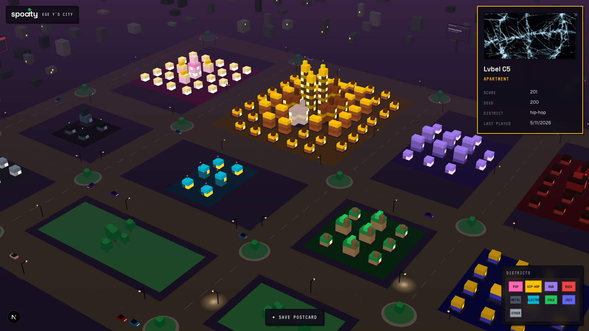
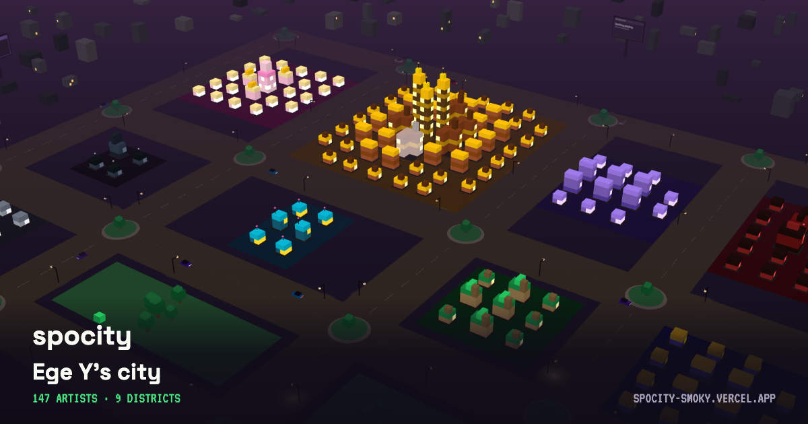

# spocity

> Your Spotify listening turned into a 3D voxel city you can walk through. Every artist you play becomes a building, and the more you listen the taller it grows. Genres settle into their own neighborhoods, and the skyline changes as your taste does.

**Live:** [spocity-smoky.vercel.app](https://spocity-smoky.vercel.app) · [connect Spotify](https://spocity-smoky.vercel.app/api/auth/login) to build your own, or explore the [demo city](https://spocity-smoky.vercel.app/demo) without signing in.


<table>
<tr>
<td width="50%"></td>
<td width="50%"></td>
</tr>
<tr>
<td align="center"><em>Click any building for the artist behind it</em></td>
<td align="center"><em>Save a shareable postcard of your city</em></td>
</tr>
</table>

## What it does

Sign in with Spotify and Spocity reads your top artists, then lays out a city within a few seconds. Each artist is a building sized by how much you listen, climbing six tiers from a one-block shack up to a landmark tower. Artists get sorted into ten genre districts, each with its own architecture and palette: brownstones with gold trim for hip-hop, glass towers for electronic, art-deco spires for jazz. Hover a building to see who it is, and the artist you are playing right now glows and pulses on its tower.

Every city lives at a public URL you can share (`/your-name`), and a **Save postcard** button renders a 1200×630 image of the skyline entirely in the browser. The demo city is the same thing without a login, so anyone can walk around one before deciding to connect their own account.

## How it works

The parts I found most interesting to build.

**Flat-shaded voxels.** The look is isometric pixel art, and normal 3D lighting fights it: shadows wash the colors with the sky tint and the shading shifts as you orbit. So nothing in the city is lit at all. Each building is baked into one merged mesh with the three-tone face shading written directly into the vertex colors, and a small unlit shader draws it. Windows carry a `glow` flag that skips the shading and reads as light against the dusk. Interior faces between voxels are dropped, so a whole building renders in a single draw call.

**Scoring that respects your history.** The first version scored artists with a two-half-life decay curve. Once it ran against real listening data, it buried anyone I loved a couple of years ago under whatever I happened to play last week, which felt wrong for a product about your taste over time. Scores are now cumulative on top of a rank-seeded starting point, and the idea of "fading" moved from the math into the visuals instead. Watching the decay model fail on real data and then cutting it taught me more than keeping it would have.

**Genres as a feedback loop.** Spotify removed genre tags from its artist objects in 2024, so tags come from Last.fm and run through an ordered keyword matcher that folds hundreds of micro-genres into ten buckets. Anything the matcher misses gets logged to its own table, so the rules improve from real misses rather than guesswork.

**A preview harness for the 3D work.** For a while the city only rendered behind a Spotify login, so every visual change shipped blind. I added a dev-only route that renders the real city from a fixed mock payload, which turned iteration into a screenshot loop. It later grew into the public `/demo` page.

## Stack

| Layer | Tech |
|---|---|
| Frontend | Next.js 15 (App Router), TypeScript, Tailwind v4, React Three Fiber |
| Backend | Django 6, Django REST Framework |
| Database | Postgres 16 (Railway in production, Docker locally) |
| Workers | Celery and Redis for hourly ingestion and nightly recompute |
| Genre data | Last.fm `artist.getTopTags` |
| Hosting | Vercel (frontend), Railway (Django and Postgres) |

The frontend proxies `/api/*` to the Railway backend through a Next.js rewrite, which keeps the Django session cookie first-party on the Vercel origin and avoids cross-site cookie problems. Because the hosted deployment runs without a Celery worker, first-login ingestion happens on demand: a quick Spotify-only seed, then a batched Last.fm classification pass with a progress bar, and a play refresh whenever a city loads.

## Architecture

```
Browser
  ├─ GET /            Next.js landing page
  ├─ GET /demo        redirects to the owner's public city (mock fallback)
  ├─ GET /<name>      public read-only city
  ├─ GET /me          your own city (Django session cookie)
  └─ client fetches   /api/* proxied to the Django backend

Django (Railway)
  ├─ Spotify OAuth (PKCE), on-demand ingest, genre rollup
  ├─ city payload + now-playing endpoints
  └─ Celery worker + beat  →  Redis
        ├─ hourly:  poll recently-played per active user
        └─ nightly: recompute scores, emit tier-change events

Postgres  ←  Django ORM            Last.fm  ←  genre tags
```

## Project structure

```
spocity/
├── frontend/
│   ├── app/
│   │   ├── page.tsx        Landing page (dusk aesthetic, live voxel hero)
│   │   ├── demo/           Public demo city, redirects to the owner's
│   │   ├── [username]/     Public per-user city pages
│   │   ├── dev/city/       Dev-only design harness (404s in production)
│   │   ├── me/             Your authenticated city
│   │   │   └── city/       3D scene: mesher, materials, buildings, HUD
│   │   └── api/auth/       OAuth login + callback routes
│   ├── components/         Wordmark, hero city, CTA + postcard
│   └── lib/                fetchAPI, auth context, district + demo data
├── backend/
│   ├── core/               models, views, genre rollup, Spotify/Last.fm clients
│   ├── start.sh            production entrypoint (migrate + gunicorn)
│   └── spocity/            Django config, Celery app
└── docker-compose.yml
```

## Running it locally

You only need Docker Desktop. Python and Node run inside the containers.

**1. Clone**

```bash
git clone https://github.com/egeyesss/spocity.git
cd spocity
```

**2. Create a Spotify app.** In the [Spotify Developer Dashboard](https://developer.spotify.com/dashboard), make an app and add `http://127.0.0.1:3000/api/auth/callback/spotify` as a redirect URI. Spotify no longer accepts `localhost`, so use `127.0.0.1` everywhere. Copy the Client ID.

**3. Set environment variables**

```bash
cp backend/.env.example backend/.env
cp frontend/.env.example frontend/.env.local
```

Put your `SECRET_KEY` and `SPOTIFY_CLIENT_ID` in `backend/.env`, and the same client ID in `frontend/.env.local` as `NEXT_PUBLIC_SPOTIFY_CLIENT_ID`. The rest can stay on the example defaults.

**4. Start everything**

```bash
docker compose up --build
docker compose exec backend python manage.py migrate
```

- Frontend: http://127.0.0.1:3000
- Backend API: http://127.0.0.1:8000/api/
- Demo city without auth: http://127.0.0.1:3000/demo

**5. Handy commands**

```bash
docker compose exec backend python manage.py <command>   # Django management
docker compose exec backend pytest                       # backend tests (106)
docker compose exec frontend npx tsc --noEmit            # typecheck
docker compose logs -f backend                           # tail backend logs
```

## Status

Spotify OAuth, on-demand ingestion, scoring, genre districts, the 3D city, public shareable pages, and the postcard generator all run in production on Vercel and Railway. The Spotify app is in development mode, which caps it at 25 approved accounts, so a sign-in that can't be approved routes to the demo city instead. Next on the list: tier-change growth animations, opt-in preview-clip audio, and a Spotify quota request to lift the account cap.

*Not affiliated with Spotify AB.*
