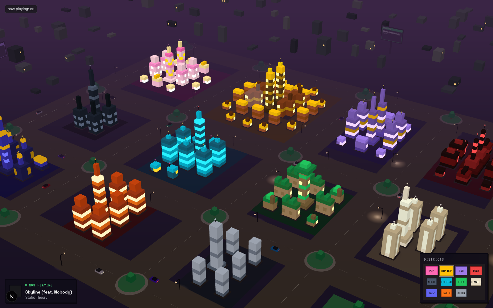
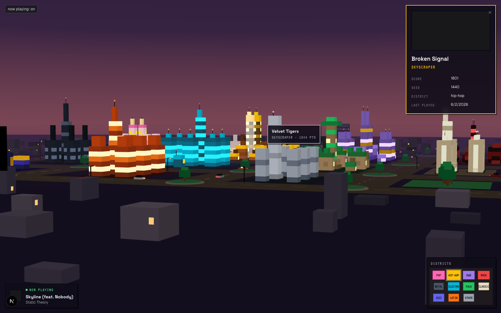
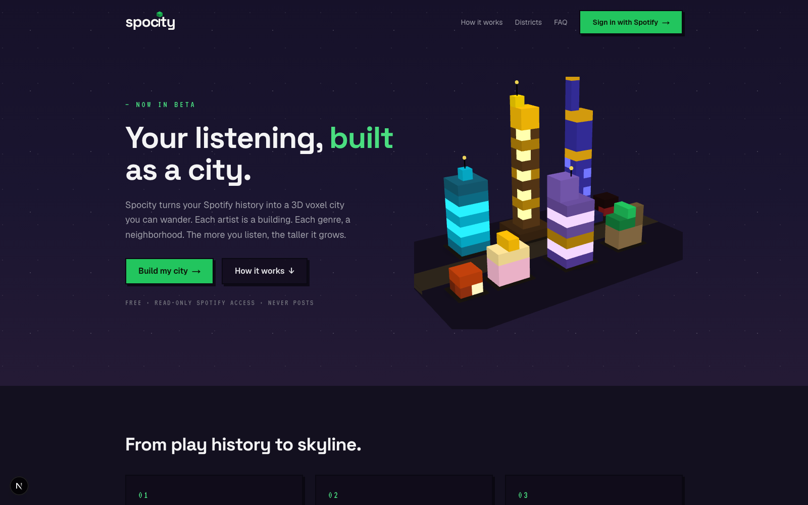

# spocity

> Your Spotify listening, built as a city. Every artist you listen to becomes a voxel building — the more you play them, the taller it grows. Genres settle into districts with their own architecture, and the skyline changes as your taste does.

**Live demo**: [spocity-smoky.vercel.app](https://spocity-smoky.vercel.app) · jump straight to the [sample city](https://spocity-smoky.vercel.app/demo) — no login needed.



| | |
|---|---|
|  |  |

---

## What it does

- **One building per artist.** Buildings climb six tiers — shack, house, apartment, office, skyscraper, landmark — driven by a score of `seed + observed plays`. Day one is seeded from your Spotify top artists so the city is full within seconds; from then on, every play Spocity observes adds a voxel's worth of progress.
- **Genre districts.** Artists are classified into ten high-level genre buckets (plus an "other" outskirts) via an ordered keyword matcher over Last.fm tags. Each district has hand-authored voxel architecture: brownstones with gold trim for hip-hop, glasshouse towers for electronic, art-deco spires for jazz.
- **A city at dusk.** Flat-shaded pixel-art voxels with baked 3-tone shading, glowing windows, streetlights, ambient traffic, procedural outskirts and a gradient sky dome. Hover any building for the artist behind it; the artist you're playing *right now* pulses.
- **Background ingestion.** Celery workers poll `recently-played` hourly per active user and recompute scores nightly, emitting tier-change events.

## Try it

The [hosted demo](https://spocity-smoky.vercel.app) is the frontend in demo mode: the landing page plus a fully interactive **sample city** built from a deterministic mock payload. Spotify caps development-mode apps at 25 allowlisted OAuth users, so the sample city is the public path into the product — the full OAuth → your-real-city flow runs in local development (setup below).

---

## Stack

| Layer | Tech |
|---|---|
| Frontend | Next.js 15 (App Router) · TypeScript · Tailwind v4 · React Three Fiber |
| Backend | Django 6 · Django REST Framework |
| Database | Postgres 16 (Docker locally) |
| Workers | Celery + Redis (hourly ingest, nightly recompute) |
| Genre data | Last.fm `artist.getTopTags` (Spotify removed artist genres in 2024) |
| Hosting | Vercel (frontend demo mode) |

## Engineering notes

A few decisions that shaped the project:

- **Baked flat voxel shading.** The reference art is isometric pixel art, which PBR lighting can't reproduce — it washes colors with the sky tint and shifts with the camera. Instead, each building is one merged, interior-face-culled `BufferGeometry` with a 3-tone face shade baked into linear vertex colors, rendered by a tiny unlit shader. Windows carry a `glow` flag and skip shading entirely so they read as light sources. An entire building is a single draw call.
- **Scores accumulate; they don't decay.** v1 shipped a two-half-life exponential decay model. Run against real listening data it erased genuinely important artists (anything loved two years ago scored below last week's background noise), so it was removed: scores are now cumulative on top of a rank-seeded anchor, and "fading" will be expressed visually (weathering) rather than numerically. Building the algorithm, measuring it against reality, and deleting it was the most useful thing this project taught me.
- **Genre rollup as a feedback loop.** Spotify stopped returning artist genres, so tags come from Last.fm and pass through an ordered substring classifier into ten buckets. Every unmatched tag is logged to a `genre_unmapped` table — the classifier improves from production data instead of guesswork.
- **A design harness, because 3D behind OAuth is invisible.** Every visual change used to ship blind (the city only rendered for a logged-in Spotify account). `/dev/city` renders the real city view from a deterministic mock payload, which made screenshot-driven iteration possible — and later became the public `/demo` route.

## Architecture

```
Browser
  │
  ├─ GET /        →  Next.js — landing (demo mode: all CTAs → /demo)
  ├─ GET /demo    →  Next.js — sample city, no auth, fully client-side
  ├─ GET /me      →  Next.js SSR → Django /api/auth/me/ (session cookie)
  └─ client fetches → Django REST API

Django
  ├─ core/        auth (Spotify OAuth PKCE), city payload, genre rollup
  └─ Celery worker + beat → Redis
        ├─ hourly:  poll /recently-played per active user
        └─ nightly: recompute scores, emit tier-change events

Postgres ← Django ORM        Last.fm ← genre tags
```

## Project structure

```
spocity/
├── frontend/
│   ├── app/
│   │   ├── page.tsx           # Landing page (dusk aesthetic, live voxel hero)
│   │   ├── demo/              # Public sample city (no auth)
│   │   ├── dev/city/          # Dev-only design harness (404s in prod)
│   │   ├── me/                # Authenticated city view
│   │   │   └── city/          # 3D scene: mesher, materials, buildings, HUD
│   │   └── api/auth/          # OAuth login + callback routes
│   ├── components/            # Wordmark, hero city, CTA buttons
│   └── lib/                   # fetchAPI, auth context, demo payload
├── backend/
│   ├── core/                  # models, views, genre rollup, Spotify/Last.fm clients
│   └── spocity/               # Django config, Celery app
└── docker-compose.yml
```

---

## Local development

Only **Docker Desktop** is required — everything runs in containers.

### 1. Clone

```bash
git clone https://github.com/egeyesss/spocity.git
cd spocity
```

### 2. Spotify Developer App

1. Go to the [Spotify Developer Dashboard](https://developer.spotify.com/dashboard) and create an app.
2. Under **Redirect URIs**, add `http://127.0.0.1:3000/api/auth/callback/spotify`.
3. Note your **Client ID** and **Client Secret**.

> **Gotcha**: Spotify no longer accepts `localhost` as a redirect URI. Use `127.0.0.1` everywhere.

### 3. Environment variables

```bash
cp backend/.env.example backend/.env
cp frontend/.env.example frontend/.env.local
```

Fill in `backend/.env`:
```
SECRET_KEY=<any long random string>
SPOTIFY_CLIENT_ID=<from dashboard>
SPOTIFY_CLIENT_SECRET=<from dashboard>
```

Fill in `frontend/.env.local`:
```
NEXT_PUBLIC_SPOTIFY_CLIENT_ID=<same client ID>
```

Everything else can stay as the example defaults.

### 4. First run

```bash
docker compose up --build
docker compose exec backend python manage.py migrate
```

- Frontend: http://127.0.0.1:3000
- Backend API: http://127.0.0.1:8000/api/
- Sample city without auth: http://127.0.0.1:3000/demo

### 5. Useful commands

```bash
docker compose exec backend python manage.py <command>   # Django management
docker compose exec backend python manage.py test        # backend tests
docker compose exec frontend npx tsc --noEmit            # typecheck
docker compose logs -f backend                           # tail backend logs
```

---

## Status & roadmap

Auth, ingestion, scoring, genre districts and the full 3D city are built and run locally; the hosted deployment is the demo-mode frontend. Planned next: public per-user city pages, the postcard/share-image generator, and tier-change growth animations.

*Not affiliated with Spotify AB.*
